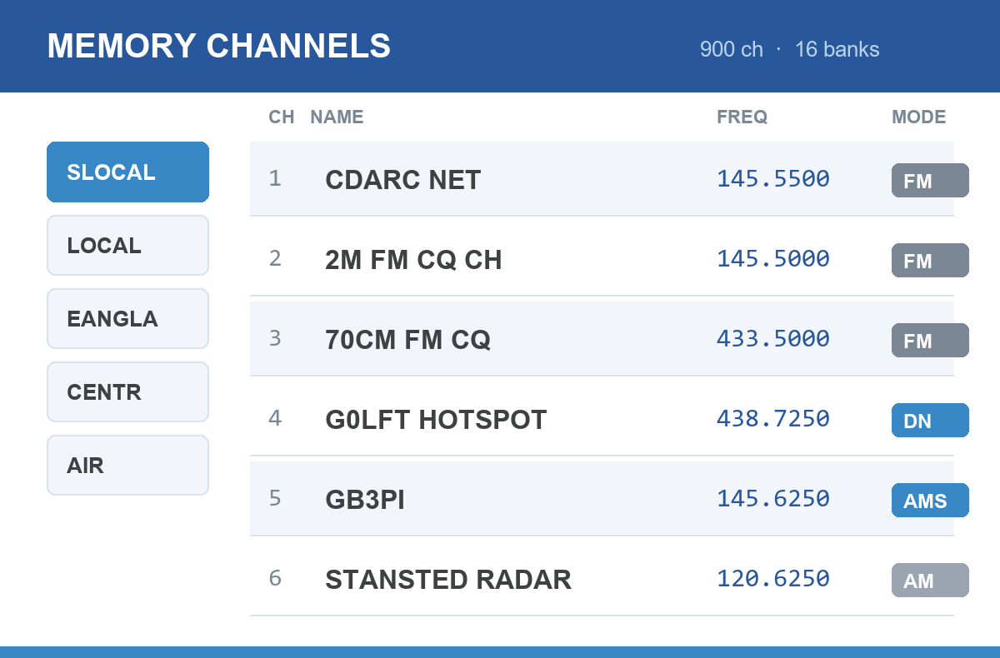

## Why bother

Typing several hundred repeaters into a handheld by hand is miserable, and you
only have to do it again the next time the repeater list changes. Every modern
Yaesu can import a CSV instead, which means the whole memory file can be
*generated*: correctly, repeatably, and organised the way you actually operate.

This guide describes the approach I use to build memory files for my FT5D and
FTM-310 from the RSGB repeater list. It's aimed at anyone comfortable running a
small script, but the format notes are useful even if you plan to edit the CSV
by hand. Some of these traps cost me a lot of time.

::: {.callout-note}
## The programming software differs per radio
Each radio has its own Yaesu application, and each expects a **different CSV
layout**. It's **ADMS-14** for the FT5D and **ADMS-20** for the FTM-310, for
example. A file built for one will not import correctly into another.
:::

## The input: the RSGB repeater list

The source data is the RSGB repeater list, exported as CSV. The columns that
matter are:

| Column | What it is |
|---|---|
| `callsign` | e.g. `GB3PI` |
| `band` | `2M` or `70CM` |
| `TX` | The **repeater's** transmit frequency, which is *your* receive frequency |
| `RX` | The **repeater's** receive frequency, which is *your* transmit frequency |
| `modes` | Mode letters: `A` analogue FM, `F` Fusion/C4FM, `D` D-Star, `M` DMR |
| `ctcss/cc` | Access tone, where one is required |
| `where` | Town or location, used for the channel name |
| `lat`, `lon` | Used for distance and regional grouping |

::: {.callout-important}
## TX and RX are from the repeater's point of view
This catches everyone once. The list's `TX` column is what you tune your
receiver to, and `RX` is what your radio transmits on. Getting these the wrong
way round produces a memory file that looks plausible and works for nothing.
:::

## What the generator does

The script reads that CSV and writes a complete memory file. The useful work is
in the decisions it makes along the way.

### Filtering

Only entries worth having end up in the file:

- Must be **FM or Fusion** (`A` or `F` in the modes column), since a D-Star-only
  or DMR-only repeater is no use to a Fusion radio.
- Must be **2 m (144–148 MHz) or 70 cm (430–440 MHz)**.
- **Cross-band repeaters are dropped.** If the input is on 2 m the output must
  also be on 2 m, otherwise the offset logic is meaningless.

### Working out the offset

The offset is derived rather than assumed, by subtracting your transmit
frequency from your receive frequency:

- difference essentially zero → simplex, direction `OFF`
- positive → `+RPT`
- negative → `-RPT`

with the magnitude used as the offset value. This handles the non-standard
splits correctly instead of hard-coding 600 kHz and 1.6 MHz everywhere.

### Choosing the mode

Straight from the mode letters:

| RSGB modes | Radio setting | Meaning |
|---|---|---|
| Both `A` and `F` | `AMS` | Automatic mode select, picking FM or C4FM per transmission |
| `F` only | `DN` | Fusion digital narrow |
| Neither | `FM` | Plain analogue FM |

### Bandwidth: the one that surprised me

UK FM channels are 12.5 kHz, so **narrow** is correct for analogue. But C4FM
needs the **wide** IF filter, or my hotspot won't decode reliably. So `Narrow`
is set `ON` for FM channels and `OFF` for anything `DN` or `AMS`.

### CTCSS

Tones are only applied when the value is a **real CTCSS tone**. The list
sometimes carries DMR colour codes in the same column, and a colour code of `7`
is not a 7 Hz tone. Validating against the standard 50-tone table and ignoring
anything below 60 Hz avoids writing nonsense into the file.

### Organising into banks

This is what makes the file pleasant to use. Repeaters are grouped by distance
from home using the haversine formula, then by region:

- **Super local** (under 25 km), the ones you actually use
- **Local** (25–50 km)
- **Regional banks** covering East Anglia, Central, the South East split
  east/west, the South West, Wales, the North split three ways, Scotland split
  north and south, and Northern Ireland

Within each bank, entries are sorted `GB` callsigns first, then `MB`, then
everything else, each sorted by distance. If a bank overflows the radio's
channel limit, it's the least useful entries that fall off the end rather than
your local repeater.

::: {.callout-warning}
## Mind the per-bank limit
The FT5D allows **100 channels per bank**. Exceed it and ADMS rejects the
import. This is why the regions are split geographically rather than lumped into
"the North", and why the FTM-310, which has no per-group limit but a
999-channel ceiling, uses a different layout.
:::

### Airband

I also include a block of receive-only airband channels covering local fields,
the London airports, VOLMET and 121.5, set to **AM**, simplex, with **8.33 kHz**
steps. Worth having somewhere in the file even if you rarely use it.

## The CSV traps

These are the ones that cost me real time.

### Every column counts, including the ones you don't use

The FT5D's ADMS-14 format has **54 fields**. I originally worked from a column
list that omitted `DCS Polarity`. That single missing field shifted everything
after it one place to the left, which quietly moved the bank flags into the
`Clock Shift` column and switched Clock Shift on for every channel. Nothing
errored; the radio just behaved oddly.

**If something is set that you never asked for, suspect a column offset**, and
count fields against a file exported from the software itself.

### Export a known-good file first

The fastest way to learn the format is to programme two or three channels by
hand in ADMS, export to CSV, and read it. That gives you the exact field count,
the exact spelling of values like `High (5W)` or `RX Normal TX Normal`, and a
reference to diff against.

### Pad the unused channels

Write a row for *every* channel, not just the ones you use. Empty rows are the
channel number followed by the right number of empty fields. A short file can
import in unexpected ways.

### Name length and character set

Names are capped (16 characters on these radios) and restricted to letters,
numbers, spaces and dashes. Strip anything else before writing rather than
letting the software silently mangle it.

## Importing

1. Open the right application for your radio, so ADMS-14, ADMS-20 and so on.
2. **File → Import** and select your CSV.
3. **Set the bank names** in the bank-names tab before doing anything else.
4. **File → Save As** to save the project file.
5. Write to the radio.

::: {.callout-caution}
## Set bank names before saving
If a bank has channels assigned but no name, ADMS-14 crashes on save with an
index error rather than telling you what's wrong. Name every bank you've used
first.
:::

Bank names are limited to six characters, which is why mine read `SLOCAL`,
`LOCAL`, `EANGLA`, `CENTR`, `NENGLS`, `SCOTS` and so on.

## Before you write to the radio

- **Back up what's on the radio first.** Read the current memory out and save
  it, so you can get back if the new file isn't what you expected.
- **Check a handful of channels by hand** against the repeater list. One
  simplex, one 2 m repeater, one 70 cm and one Fusion, before trusting the other
  895.
- **Check the offsets** on a couple of non-standard repeaters specifically.

## Doing it yourself

The generator is a single Python script with no dependencies beyond the standard
library, just `csv`, `math` and `re`. If you want to adapt the approach, the
parts you'd change are your home latitude and longitude, the bank boundaries,
and the field layout for your particular radio.

Mine are on GitHub as
[yaesu-memory-builder](https://github.com/IanHenry/yaesu-memory-builder), MIT
licensed. `--lat` and `--lon` set your own location, and your club net, hotspot
and simplex channels go in a `special_channels.csv`.

## Related

- [Radio Memory Builder](../../projects/radio-memory-builder.qmd), the project page
- [UK repeater list (RSGB ETCC)](https://ukrepeater.net/repeaterlist.html)


